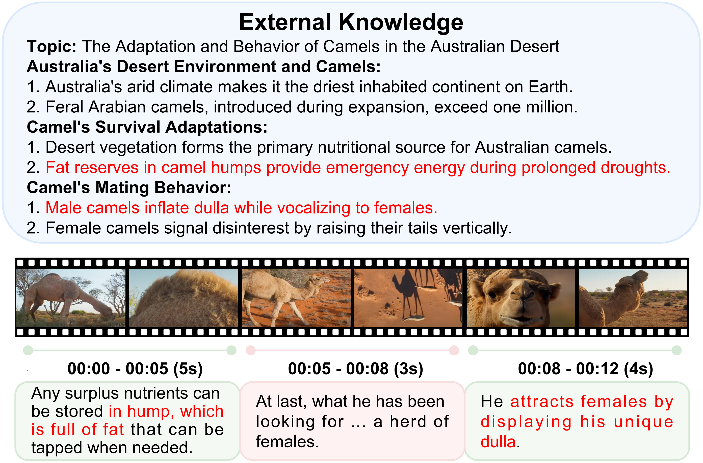
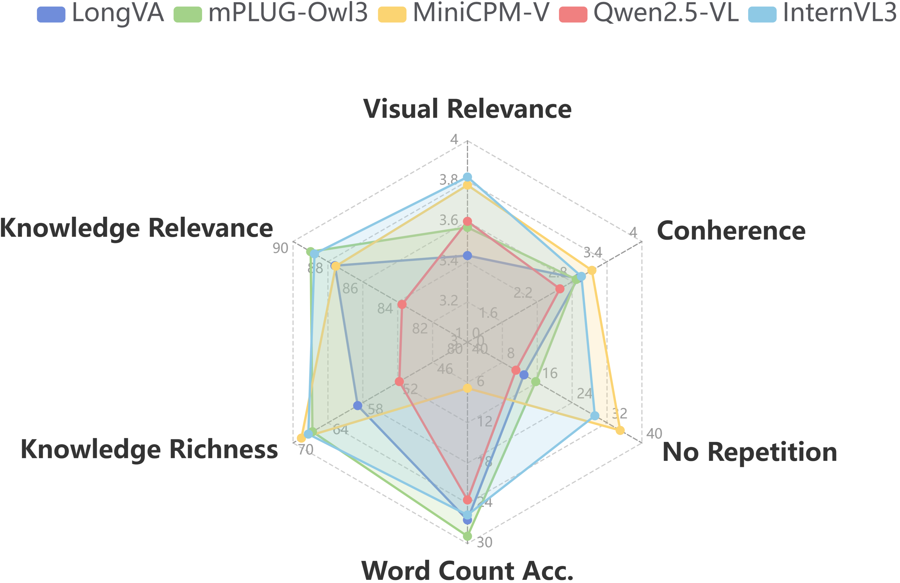

# HowToNarrate: A General-Domain Benchmark for Synchronized Video Narration with External Knowledge

[](#)
[](#)
[](#)
[](#)

> **🎉 Accepted to the Main Conference of ACL 2026!**
> 
> **We will release all data and code soon to support future research in synchronized video narration.**

## 📖 Overview
This repository will host the official codebase, models, and dataset for our paper **HowToNarrate**. We are currently organizing the code and preparing the data files for public access. 

## 🚀 Updates
- **[April 2026]**: Our paper has been accepted to **ACL 2026 Main Conference**! 
- **[March 2026]**: Repository initialized. The data and code release is currently in progress. Stay tuned!

## 📌 To-Do List
- [ ] Release paper preprint
- [ ] Release the HowToNarrate dataset
- [ ] Release the evaluation scripts and baseline models
- [ ] Provide setup and training instructions

## 🖼️ Dataset & Evaluation


*Figure 1: A case from our dataset.*


*Figure 2: Performance of current MLLMs.*

## 📝 Citation
If you find our work or dataset useful in your research, please consider citing our paper:

```bibtex
@inproceedings{}
